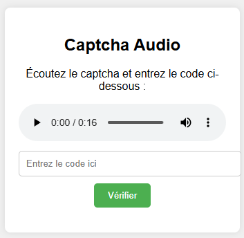

# audio_captcha_login

  Voici la structure du projet mise à jour :
  
  > /mon-projet
   
   ├── server.js
  
   ├── index.html
  
   ├── public
   
           └── captcha-audio.mp3
   
   ├── secrets
  
            └── captcha.txt
 
    
  Dans cet exemple, captcha.txt est dans un dossier secrets qui ne doit pas être servi directement.

### server.js
    const express = require('express');
            
    const fs = require('fs');
    
    const path = require('path');
    
    const app = express();
    
    const port = 3000;
    
    // Servir les fichiers statiques uniquement depuis le dossier 'public'
    
    app.use(express.static(path.join(__dirname, 'public')));
    
    // Route pour la page d'accueil
    
    app.get('/', (req, res) => {
    
    res.sendFile(path.join(__dirname, 'index.html'));
    
    });
    
    // Endpoint sécurisé pour lire le fichier captcha.txt
    
    app.get('/get-captcha', (req, res) => {
    
    // Lecture du fichier captcha.txt dans un dossier sécurisé
      
    const captchaFilePath = path.join(__dirname, 'secrets', 'captcha.txt');
  
      fs.readFile(captchaFilePath, 'utf8', (err, data) => {
      
          if (err) {
          
              res.status(500).send('Erreur lors de la lecture du fichier captcha.');
              
          } else {
          
              // Envoie le contenu du fichier sans espace supplémentaire
              
              res.send(data.trim());
              
          }
          
      });
      
    });
    
    // Démarre le serveur
    app.listen(port, () => {
    
        console.log(`Serveur en écoute sur http://localhost:${port}`);
        
    });

    
### Explications

  Structure des dossiers :

  public : contient uniquement des fichiers qui peuvent être accessibles publiquement (par exemple, captcha-audio.mp3).

  secrets : contient des fichiers sensibles, comme captcha.txt. Ce dossier ne doit jamais être servi directement.

### Servir des fichiers sécurisés via un endpoint :

  L'endpoint /get-captcha lit le contenu de captcha.txt de manière sécurisée et envoie uniquement le texte via une réponse HTTP.
  
  Le fichier captcha.txt n'est jamais exposé directement dans le navigateur, seul le contenu est envoyé lorsqu'une requête est faite.

### Étape pour Lancer le Serveur

Assurez-vous que votre structure de fichiers est correcte.

### Lancez le serveur avec la commande :

  node server.js

### Accédez à votre application via le navigateur à http://localhost:3000.

#### Remarque
  
  En utilisant cette méthode, seul le serveur a accès à captcha.txt. Le navigateur ne peut voir que les réponses aux requêtes HTTP.
  
  Pour une sécurité renforcée, pensez à ajouter des mécanismes d'authentification et des protections contre les attaques CSRF (Cross-Site Request Forgery) si nécessaire.
  
  Si vous souhaitez ajouter plus de sécurité, envisagez l'utilisation de HTTPS et d'un système de jetons pour s'assurer que seules les requêtes légitimes puissent accéder au captcha.
  
